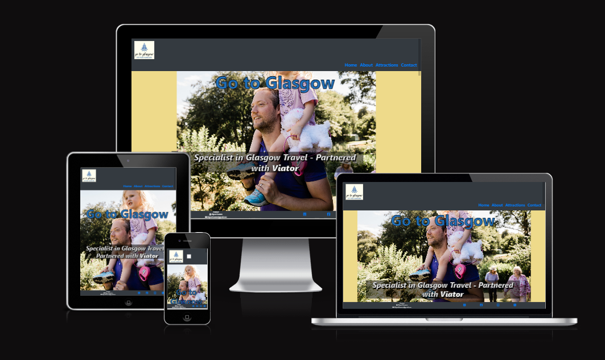
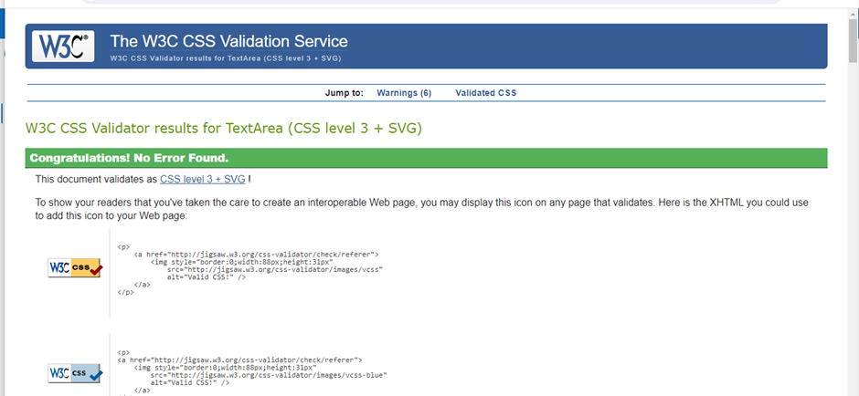
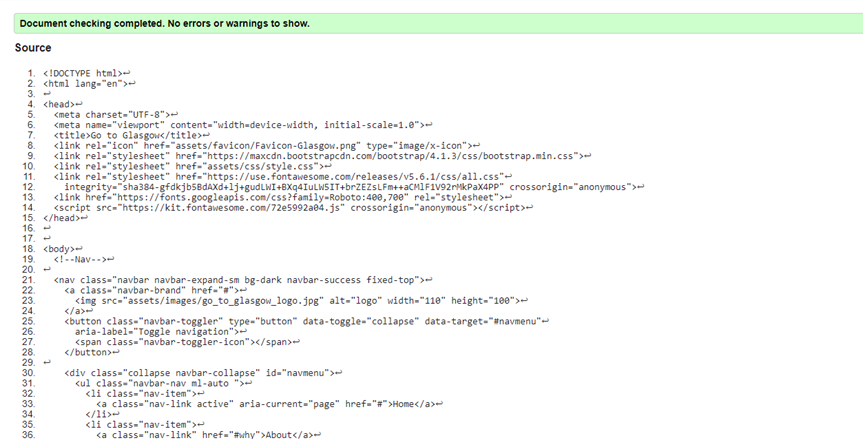

# Go to Glasgow Website

## Names of Contributors

Sam Danzig,  
Daniel Favell,
Manjula Lal,

## Benefits and Purpose of Website

'Go to Glasgow' is a website specifically targetting to families who wish to go on a day trip and are curious about Glasgow as a destination. The website provides a number of possible options for families, reducing the stress of finding suitable places to bring a family, and gives a simple description of why Glasgow is a great place to visit. There is a description of each tourist attraction conveniently accessed by clicking a 'flipcard', again making the process of choosing where to visit simple and accessible and user friendly especially when using smaller apps to view the webpage. 

## Contents of Website and Key Features

The website has used Bootstrap and CSS to help format and function to a good standard. It containes hyperlinks for navigation and was initially build for mobile users leading to desktop functioning where we aim to provide a good user experience for all. Blue was the theme for the  project. Verm warm, welcoming and appeasing to look at at first glance and easy to understand the website without user distractions whereby eventually sponsors will be added so the free space will be needed. The nav bar was created using boot strap, where the nav links were directed to material throughout the webpage. A hambuger bar was created for mobile user which expanded in to a full navigation bar after small screen.     

The body of the  presents 6 different attractions in the Glasgow area as well as a short introduction to Glasgow as a tourist destination. There is a contact form to sign up to a newsletter which will provide regularly updated information about events of interest in Glasgow, and links to social media sites are provided. The floating nav-bar provides a convenient way to access the different sections of the site, with smaller screens displaying a burger menu for ease of use. The site utilises only one page, making it ideal for mobile phone users. Each attraction is displayed by an image and clicking on the image reveals a description, providing an enjoyable point of interaction whilst keeping the main page aesthetically clean and intuitive. A floating footer ensures that the user is easily able to sign up for the newsletter from anywhere on the website.

## Bugs Fixed and Unfixed

A major problem was that the central hero image would not remain with a fixed top margin, hiding the girl's head in the hero image, underneath the nav bar at larger screen sizes. Eventually the problem was solved by setting a media query which gave the image a max width, and it was accepted that there would be borders around the image at higher resolutions. Another bug was that the subheading across the main hero image kept moving up and down at different screen resolutions, sometimes appearing below the image itself. Eventually this was fixed through padding settings and several media queries, which stabilised the position of the subheading throughout different screen sizes. Unfortunately it could not be worked out how to make the background image opaque without making the text on top also opaque. Opacity of the image had been the preferred option since this would ensure the contrast on the main heading would be very clear and accessible. Additionally the nav-bar is too large vertically on larger screens and finding out a way to shorten it so that the logo and nav items are aligned would be a priority given more time. The navbar also partially covers the top of each section as it is navigated to, making for a more limited user experience.

## Development Strategy and UX considerations
Using Figma as a wireframe development tool, a visual draft was drawn up of the website, where it was agreed that having only one page would express a mobile first orientation and provide ease of use across larger screen sizes too. 

![figma design] (readme-images/figma_design.png)

Using Trello, a popular project board, we designed user stories and distributed work. Work that was not going to be completed within the iteration time will be put in another list for the second iteration.

![Trello] (readme-images/trello.png)

It was decided that the header and footer would be floating for convenience and that 'flipcard' interaction would be used for the main content of the website. The flipcard design would make the page aesthetically clean and simple and create a positive user experience. In addition, a colour scheme was chosen of blues and beiges, originally because the icon for 'Go to Glasgow' had been a blue colour. Other ideas at this stage of development were trialled too, including having a live-chat option and a 'share with friends' feature for the various attractions, however these were discarded through implementaion of user stories where it was felt that they would not provide enough benefit to justify their use.

It was decided that the coding would proceed by splitting the project three ways: footer, main section, and nav-bar, with each contributor developing one of these before meeting up to collaborate on testing and bug-fixing etc. Bootstrap was used extensively on the project, and flexbox was used for wrapping the flipcards at different screen resolutions, as well as for the footer social media icons.

## Future Features and Modifications

Future features should include hidden section headings for SEO and screen readers. The code could also be cleaned up, with redundancies removed. Sharper pictures could be found for the flipcards and the text on the reverse could be bigger for better accessibility. Some of the features that were dismissed at the ux development phase could be reintroduced, such as a live chat option and a list of offers on the various attractions.

## Testing
The website was tested after deployment on the W3C HTML and CSS checkers, as well as the WCAG colour contrast checker.

## Credits

The logo was generated using the AI logo generator site Looka.com. Font Awesome was used for icons and Google Fonts was used for fonts. W3 Schools was regularly referred to during the development process, and the code for the 'flipcards' as well as the button which links to the 'Viator' booking website were taken from there.
Tutorials were also looked at to enhance knowledge material and the bootstrap website was used to attain code and links and scripts.
https://www.youtube.com/watch?v=31wzhvz0vsw 
https://www.youtube.com/watch?v=4sosXZsdy-s&t=817s
Used the loverunning ReadMe file to help create the images of this ReadMe
## Key gratitude 

Thank you for the great support us developers had recieved from code institude. The valuable guidance and support we got from David Calikes, Martin and Kevin has helped us developers being able to understand each aspect of the project and have provided us with full support where required. 